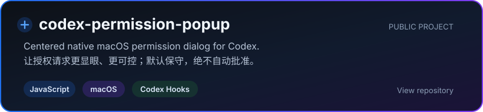

  

  <h3>你好，我是 Carry 👋</h3>

  

    <strong>2026 届应届生 · 即将成为后端工程师 · AI Native Builder</strong>
  

  
用工程能力构建可靠的后端系统，也把 AI 想法做成真正可用的产品。

  

    
    
  

## 关于我 · About Me

- 🚀 2026 届应届生，即将进入一线互联网公司从事后端开发
- 🧱 持续打磨后端基础、系统设计与可靠服务构建能力
- 🤖 关注 LLM 应用、AI Agent、多智能体系统与 AI 产品工程
- 🛠️ 喜欢从真实问题出发，做简单、可靠、真正有人愿意使用的工具
- 🌱 记录学习、构建与迭代过程，寻找自己的第二增长曲线

## 当前坐标 · Now

| 方向 | 正在做的事 | 目标 |
| --- | --- | --- |
| **Backend Engineering** | 深入 Java 后端、系统设计与工程实践 | 构建稳定、可维护的服务 |
| **AI Engineering** | 探索 LLM 应用与 Agent 系统 | 把 AI 能力落到真实工作流 |
| **Indie Building** | 从小工具开始持续交付 | 做出有人使用的产品 |

## 代表项目 · Featured Project

  

> **codex-permission-popup**：把 Codex 的授权请求转换为居中的 macOS 原生弹窗，并以保守、安全的方式处理允许、拒绝与返回操作。

## 技术栈 · Tech Stack

  

正在使用，也在持续深入。

## 构建原则 · Principles

| Reliable Systems | Useful AI | Continuous Shipping |
| :---: | :---: | :---: |
| 可靠与安全优先 | 解决真实问题 | 用交付推动成长 |

## 保持联系 · Connect

如果你也在探索后端工程、AI Agent 或独立产品，欢迎通过 [GitHub](https://github.com/carryclaw) 与我交流，也可以访问我的个人网站 [carrychen.com](https://www.carrychen.com)。

   
  <i>Build reliable systems. Ship useful AI products.</i>
    
  

